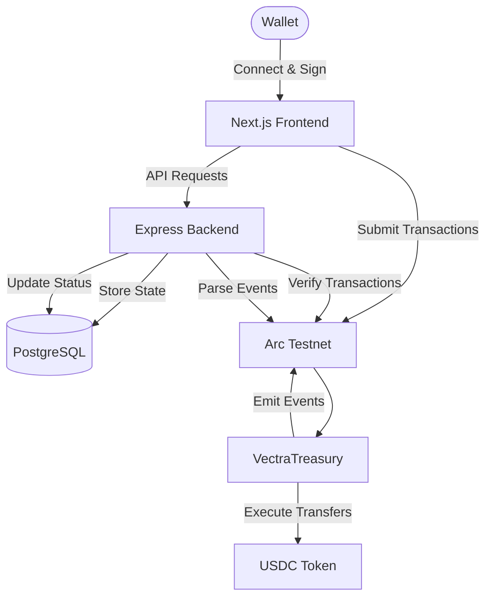
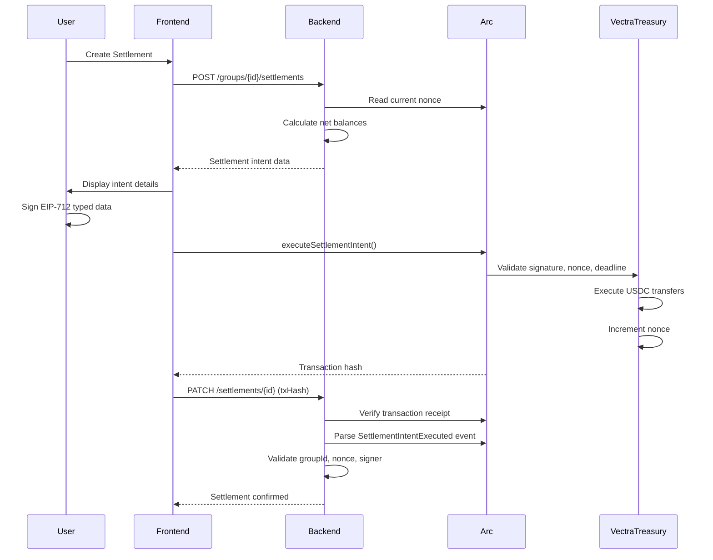

# Vectra — Intent-Based Group Treasury & USDC Settlement on Arc

Vectra transforms shared expenses into executable settlement intents, enabling groups to authorize and execute optimized USDC transfers on-chain via Arc Testnet.

[**Live Demo**](https://vectra-sage.vercel.app) • [**GitHub**](https://github.com/Pixie-19/Vectra) • [**Backend**](https://vectra-endh.onrender.com) • [**Contract**](https://testnet.arcscan.app/address/0x1e82280fA9148F0d16Ac800eAE958502f07D44Ea)

---

## The Problem

Group expense apps calculate who owes whom, but settlement remains entirely manual. Users must:

- Individually coordinate each payment
- Manually track whether transfers completed
- Execute multiple fragmented payments across platforms
- Lack verifiable on-chain settlement records

**Result:** Financial obligations are computed off-chain but never executed on-chain as coordinated settlement.

---

## The Solution

Vectra uses **intent-based settlement** to bridge off-chain expense tracking and on-chain execution:

1. **Track Expenses** — Record shared costs, identify payers
2. **Compute Obligations** — Calculate net balances across group members
3. **Create Settlement Intent** — Package optimized transfers with nonce, deadline
4. **Authorize with EIP-712** — Coordinator signs typed settlement data
5. **Execute Atomically** — Smart contract validates signature, executes USDC transfers
6. **Verify On-Chain** — Backend confirms transaction, marks expenses settled

**Key Innovation:** Rather than manually coordinating payments, the group coordinator signs a single settlement intent that executes all required USDC transfers atomically on Arc.

---

## How It Works

1. **Connect Wallet** — Wallet address serves as user identity
2. **Authenticate** — Sign challenge message, receive session token
3. **Create/Join Group** — On-chain group registration via `VectraTreasury.registerGroup()`
4. **Record Expenses** — Track description, amount, payer
5. **Generate Settlement** — Backend calculates net balances, creates settlement intent
6. **Sign EIP-712 Intent** — Coordinator authorizes typed settlement data
7. **Execute On-Chain** — Contract validates signature, checks nonce/deadline, executes USDC transfers
8. **Verify Settlement** — Backend confirms transaction, parses events, updates database

---

## Architecture



**Data Flow:**
- **Authentication:** User signs challenge → Backend validates → Session token issued
- **Expenses:** Frontend → Backend → PostgreSQL
- **Settlement Creation:** Backend computes obligations → Creates pending settlement
- **Settlement Execution:** Frontend → User signs EIP-712 → Arc validates → USDC transfers
- **Settlement Verification:** Backend reads transaction → Parses events → Marks settled

---

## Key Technical Features

- **Intent-Based Settlement** — Declarative multi-party transfers, not manual coordination
- **EIP-712 Typed Signatures** — Structured, human-readable authorization
- **Settlement Snapshots** — Exact correlation between on-chain execution and expense sets
- **Nonce-Based Replay Protection** — Per-group nonces prevent duplicate settlements
- **Deadline Enforcement** — Time-bounded settlement validity
- **Atomic Multi-Transfer** — All USDC transfers succeed or transaction reverts
- **On-Chain Verification** — Backend independently verifies Arc transaction receipts and events
- **Wallet-Based Auth** — Challenge-response flow with session tokens
- **Coordinator Authorization** — Only registered coordinator can authorize settlements

---

## Why Arc + USDC?

**Arc Testnet** provides the execution environment for settlement transactions with EVM compatibility, enabling Solidity smart contracts and EIP-712 signatures.

**USDC** offers stable-value denomination for group expenses, avoiding price volatility between expense recording and settlement. All treasury operations (recording, calculation, execution, history) use consistent USDC units.

**Combined:** Programmable stablecoin settlement with verifiable on-chain execution and transparent transaction history.

---

## Tech Stack

| Layer | Technology |
|-------|-----------|
| **Frontend** | Next.js 16, React 19, TypeScript |
| **Web3** | wagmi 3.7, viem 2.56 |
| **Backend** | Node.js, Express 5, TypeScript |
| **Database** | PostgreSQL, Prisma ORM |
| **Blockchain** | Arc Testnet (Chain ID: 5042002) |
| **Contracts** | Solidity 0.8.24, Foundry |
| **Settlement Asset** | USDC (`0x3600000000000000000000000000000000000000`) |

---

## Deployment

**Frontend:** [https://vectra-sage.vercel.app](https://vectra-sage.vercel.app) (Vercel)

**Backend:** [https://vectra-endh.onrender.com](https://vectra-endh.onrender.com) (Render)

**Contract:** `0x1e82280fA9148F0d16Ac800eAE958502f07D44Ea` ([View on Arcscan](https://testnet.arcscan.app/address/0x1e82280fA9148F0d16Ac800eAE958502f07D44Ea))

**Network:** Arc Testnet (Chain ID: 5042002)

**USDC:** `0x3600000000000000000000000000000000000000`

---

## Smart Contract

**VectraTreasury** provides intent-based settlement for group treasuries on Arc Testnet.

### Core Functions

**`registerGroup(bytes32 groupId)`**
- Registers group on-chain
- Sets `msg.sender` as coordinator
- Initializes nonce to 0

**`executeSettlementIntent(SettlementIntent calldata intent, bytes calldata signature)`**
- Validates EIP-712 signature against coordinator
- Checks nonce matches on-chain state
- Validates deadline has not expired
- Executes all USDC transfers atomically
- Increments nonce
- Emits `SettlementIntentExecuted` event

### Settlement Intent Structure

```solidity
struct SettlementIntent {
    bytes32 groupId;      // Group identifier
    uint256 nonce;        // Replay protection
    uint256 deadline;     // Expiration timestamp
    address[] from;       // USDC senders
    address[] to;         // USDC recipients
    uint256[] amounts;    // Transfer amounts
}
```

**Security Features:**
- EIP-712 typed signatures prevent signature phishing
- Per-group nonces prevent replay attacks
- Deadline checks reject expired settlements
- Coordinator validation ensures only authorized signers
- Atomic execution (all transfers succeed or transaction reverts)

**Source:** [`contracts/VectraTreasury.sol`](./contracts/VectraTreasury.sol)

---

## Settlement Flow



---

## Data Model

**Users** — Wallet-based identity with session management

**Groups** — On-chain registered groups with coordinator and invite codes

**Memberships** — User-group relationships with role (COORDINATOR or MEMBER)

**Expenses** — Shared expenses tracked per group with settlement status

**Settlements** — Settlement intents with nonce, status (PENDING/COMPLETED), and transaction hash

**AuthChallenges** — One-time nonces for wallet authentication

**AuthSessions** — Session tokens with expiration

**Key Database Constraints:**
- `(groupId, nonce)` uniqueness prevents duplicate settlements
- `transactionHash` uniqueness prevents transaction reuse
- `walletAddress` uniqueness enforces one user per wallet

---

## Local Development

### Prerequisites

- Node.js 18+
- PostgreSQL 14+
- Web3 wallet (MetaMask, etc.)
- Arc Testnet USDC

### Setup

**1. Clone Repository**
```bash
git clone https://github.com/Pixie-19/Vectra.git
cd Vectra
```

**2. Backend Setup**
```bash
cd backend
npm install

# Configure environment
cp .env.example .env
# Edit .env with DATABASE_URL and FRONTEND_URL

# Run migrations
npx prisma migrate dev
npx prisma generate
```

**3. Frontend Setup**
```bash
cd frontend
npm install

# Configure environment
cp .env.local.example .env.local
# Edit .env.local with NEXT_PUBLIC_API_URL
```

**4. Start Services**
```bash
# Terminal 1: Backend
cd backend
npm run dev

# Terminal 2: Frontend
cd frontend
npm run dev
```

**5. Access Application**

Open [http://localhost:3000](http://localhost:3000)

### Available Commands

**Backend:**
```bash
npm run dev          # Start development server
npm run build        # Compile TypeScript
npm start            # Run production build
npx prisma studio    # Database GUI
npx prisma migrate dev  # Create migration
```

**Frontend:**
```bash
npm run dev          # Start dev server
npm run build        # Build for production
npm start            # Start production server
npm run lint         # Run ESLint
```

**Contracts:**
```bash
forge build          # Compile contracts
forge test           # Run tests
forge script         # Deploy contracts
```

---

## Security & Limitations

**Security Features:**
- Wallet signature authentication (challenge-response)
- Session token management (7-day expiration)
- EIP-712 typed signatures for settlement authorization
- Nonce-based replay protection
- Deadline-based expiration
- On-chain transaction verification
- Database unique constraints prevent races

**Limitations:**
- **Testnet Prototype** — Not audited for production use
- **No Rate Limiting** — Basic infrastructure only
- **No DDoS Protection** — Development-grade deployment
- **Limited Input Sanitization** — Basic validation only
- **Testnet Only** — Arc Testnet and test USDC

**Disclaimer:** This is a hackathon/testnet prototype demonstrating intent-based settlement concepts. It has not undergone independent security audits and should not be used with real funds without thorough security review.

---

## Roadmap

- **Multi-Token Settlement** — Support tokens beyond USDC
- **Recurring Settlements** — Scheduled, time-based settlement intents
- **DAO Treasury Workflows** — Governance-approved multi-beneficiary payouts
- **Advanced Treasury Policies** — Spending limits, approval thresholds
- **Batch Operations** — Bulk expense recording and settlement creation

---

## Contributing

Contributions welcome! Please open issues for bugs or feature requests.

---

## License

This project is licensed under the [MIT License](LICENSE).

---

**Built for hackathon demonstration of intent-based treasury settlement on Arc Testnet.**
